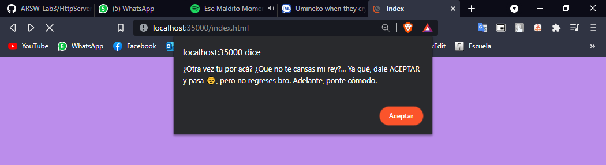
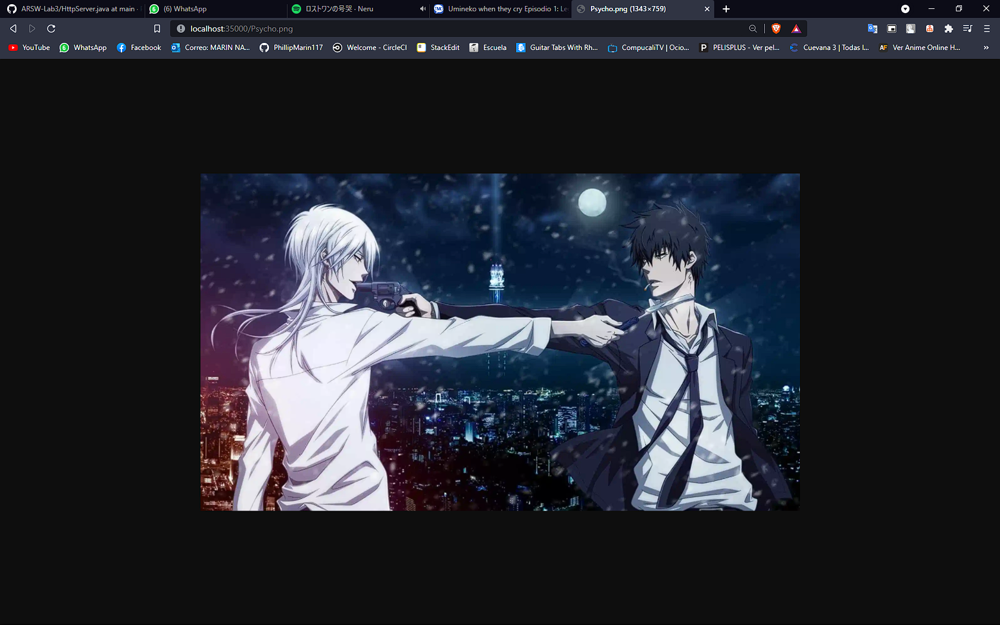
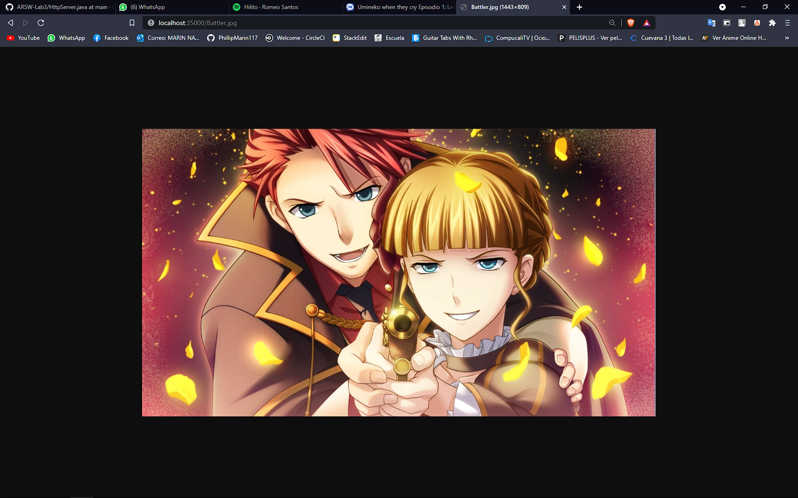
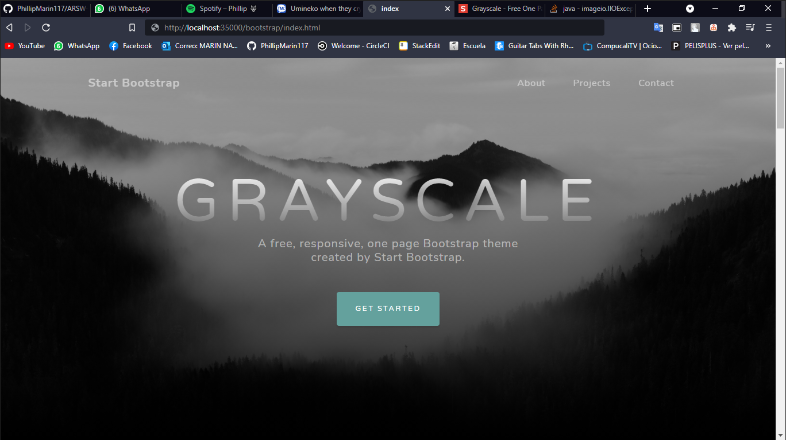
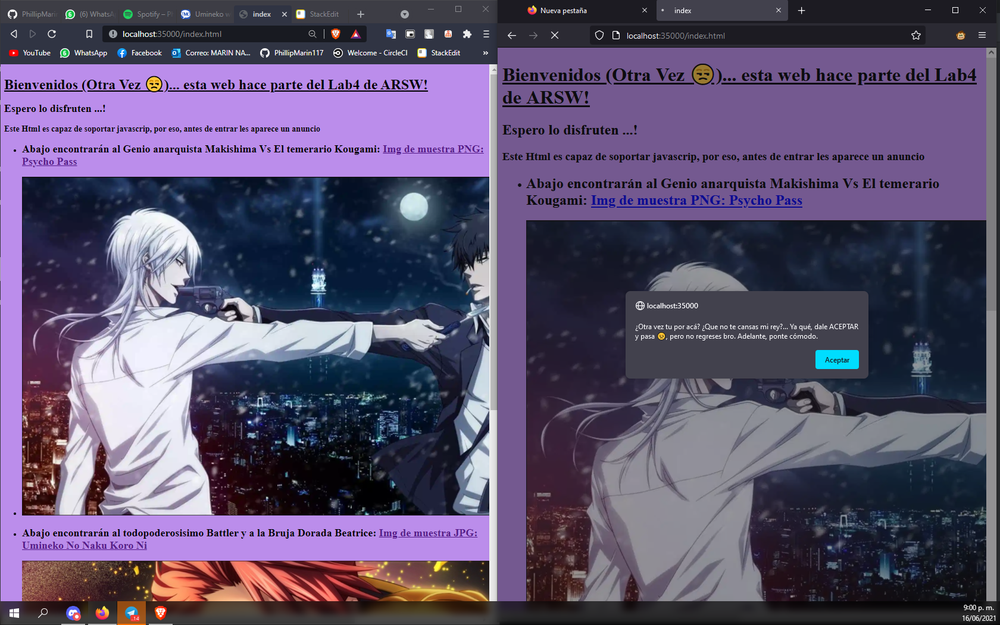
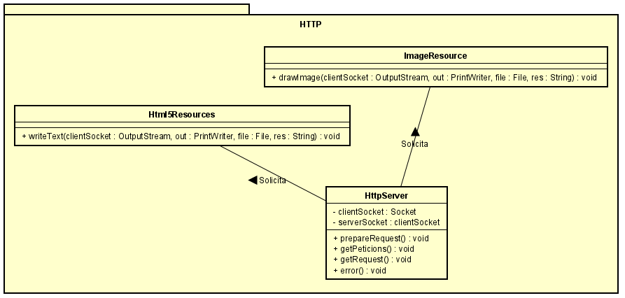

# Lab4 ARSW- Servidor Web Concurrente

El siguiente repositorio contiene varios ejercicios en los cuales se vera una introducción a temas relacionados con manejo de URL's, Sockets por parte de un servidor y un cliente.

## Instrucciones de uso

Para poder usar el proyecto lo primero que debe realizar es clonar este repositorio utilizando el siguiente comando desde la terminal del S.O que este utilizando:

```
git clone https://github.com/PhillipMarin117/ARSW-Lab4
```
Otra alternativa es descargarlo directamente por formato ZIP en el botón que indica **"Clone or Download".**
Luego debe redirigirse por medio de la terminal al directorio raíz la cual contiene el archivo pom.xml.

Una vez se encuentre en este directorio se debe compilar el programa para esto se debe ejecutar el siguiente comando:

```
mvn package
```
### Prerequisitos

Para ejecutar con éxito este programa se requiere de los siguientes programas instalados en su máquina. Se recomienda tener las versiones actualizadas, pero si no al menos con las versiones básicas funcionales. Para lograr conocer si tiene instalados los programas y de paso la versión, ejecute los siguientes comandos
```
java -vesion
git --vesion
mvn -version
```

Le debería aparecer de la siguiente manera
```
java version: "1.8.0_171"
git version: 2.19.1.windows.1
Apache Maven version: 3.6.3
```
Una vez compliado el repositorio completo se encuentra en posibilidad de probar los siguientes ejercicios:


###  EJERCICIO  - HTML

Escriba un servidor web que soporte múltiples solicitudes seguidas de manera concurrente usando hilos. El servidor debe retornar todos los archivos solicitados, incluyendo páginas html, css, javascript e imágenes.

#### Comando para ejecutar HttpServer:
```
java -cp target/ARSW-Lab4-1.0-SNAPSHOT.jar edu.escuelaing.arsw.app.HTML.HttpServer
```
Una vez ejecutado diríjase a su navegador de confianza y escriba en el buscador **[localhost:35000/index.html](localhost:35000/index.html)** y lo dirigirá al servidor creado por mi.
El siguiente programa soporta HTML, JavaScrip y CSS usando una plantilla de Bootstrap.

#### Acceso y soporte de JavaScript



#### Acceso a HTML (http://localhost:35000/index.html)


#### Acceso a imagen PNG (http://localhost:35000/Psycho.png)



#### Acceso a imagen JPG (http://localhost:35000/Battler.jpg)



#### Acceso a CSS con Bootstrap (http://localhost:35000/bootstrap/index.html)



#### Prueba de que se ejecuta en dos o mas ventanas/navegadores al mismo tiempo




## Diagrama de clases

La siguiente imagen muestra los diagramas de clases contenidos en sus respectivos paquetes en los cuales se encuentran las clases de HtmlServer y las clases encargadas de la lectura de archivos solicitados por el cliente.




## Construido con


* [Maven](https://maven.apache.org/) - Dependency Management
* [Java](https://www.java.com/es/download/) - Lenguaje de programación
* [JavaScript](https://www.javascript.com/) - Lenguaje de programación
* HTTP 
* [Git](https://github.com/) - Versionamiento


## Authors

* **Felipe Marín** - *LOCS/Hora  242/4 = 60.5 LOCS/Hora* - Fecha: 16/06/2021


## Licencia

This project is licensed under the MIT License - see the [LICENSE.md](LICENSE.md) file for details